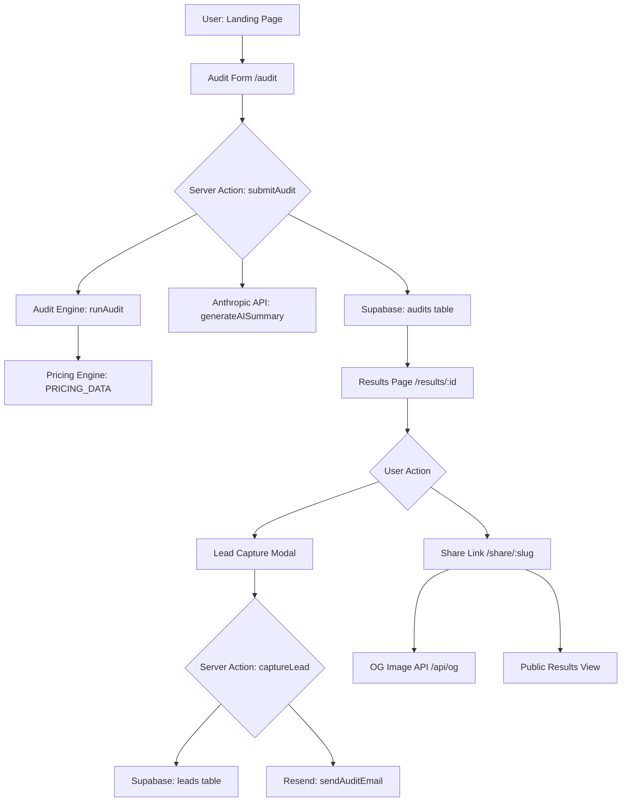

# Architecture

## System Overview

SpendLens is a Next.js 15 App Router application with a feature-based architecture. No login required — the entire audit flow is stateless from the user's perspective.

---

## Mermaid Diagram



---

## Directory Structure

```
src/
├── app/                    # Next.js App Router
│   ├── layout.tsx          # Root layout + metadata
│   ├── page.tsx            # Landing page
│   ├── audit/page.tsx      # Audit form
│   ├── results/[id]/       # Results (client, localStorage)
│   ├── share/[slug]/       # Public shared audit (SSR + OG)
│   └── api/og/route.tsx    # OG image generation (Edge)
│
├── features/               # Feature modules
│   ├── audit/
│   │   ├── engine.ts       # Core audit logic (pure functions)
│   │   ├── actions.ts      # Server Actions
│   │   └── AuditForm.tsx   # Form UI
│   ├── landing/
│   │   └── LandingPage.tsx
│   └── results/
│       ├── ResultsPage.tsx
│       └── LeadCaptureModal.tsx
│
├── lib/                    # Shared services
│   ├── pricing.ts          # Centralized pricing data
│   ├── ai/summary.ts       # Anthropic integration
│   ├── email/audit-email.ts # Resend integration
│   └── supabase/           # Supabase clients
│
├── components/ui/          # Reusable UI primitives
│   ├── button.tsx
│   ├── input.tsx
│   ├── card.tsx
│   └── badge.tsx
│
├── types/index.ts          # Shared TypeScript types
├── utils/
│   ├── format.ts           # Currency formatting
│   └── nanoid.ts           # ID generation
└── __tests__/
    └── audit-engine.test.ts
```

---

## Data Flow

### Audit Submission
1. User fills AuditForm → validates with Zod
2. `submitAudit` Server Action called
3. `runAudit()` engine processes tools deterministically
4. `generateAISummary()` calls Anthropic (with fallback)
5. Result stored in Supabase `audits` table
6. Result also stored in localStorage for instant client access
7. User redirected to `/results/:id`

### Lead Capture
1. User clicks "Get Report" on results page
2. LeadCaptureModal shown with React Hook Form + Zod
3. Honeypot field checked server-side
4. Rate limit: 3 submissions per email per hour
5. Lead stored in Supabase `leads` table
6. Audit fetched and email sent via Resend

### Share Link
1. Each audit gets a random 8-char `shareSlug`
2. `/share/:slug` is server-rendered with full metadata
3. OG image generated dynamically at `/api/og?slug=...`
4. PII (email, company) never stored in audit record

---

## Key Design Decisions

| Decision | Rationale |
|---|---|
| No auth | Maximize conversion; email captured post-value |
| Pure audit engine | Defensible numbers; no AI hallucinations in math |
| Edge OG images | Global CDN, fast social crawlers |
| Honeypot + rate limit | Zero UX friction bot protection |
| LocalStorage results | No session management needed |
